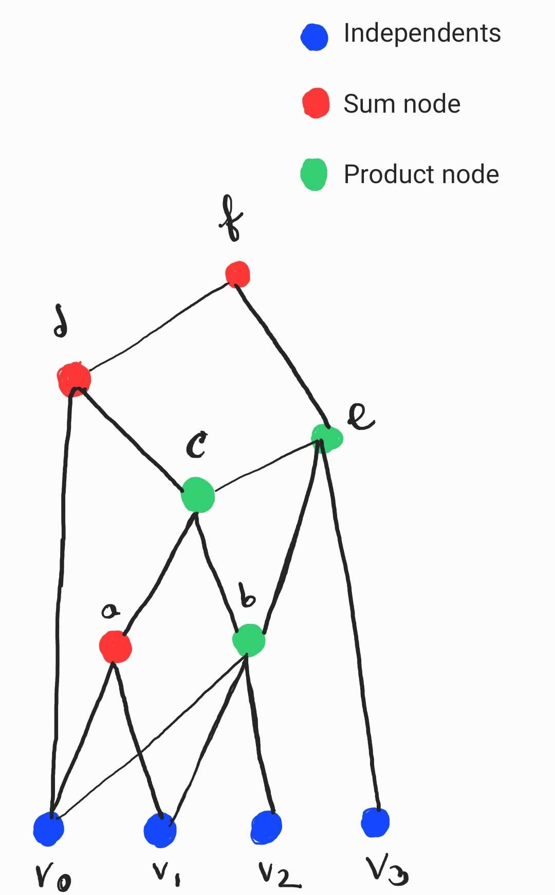

# A constraint-based local search library for Python

We have tried to create a local search library written in python with an aim of solving puzzle problems (eg: Magic-square , N-queen, etc.).  This library is not written to solve only a specific problem, rather it's written generally for all the puzzle problems. Due to the limitation of time, we have only showed an example of solving Magic-square based on random-walk search algorthim with our library. This project can be further developed by adding more features and search algorithms (eg: hill-climbing) in future. 

Currently, this repository has three versions on three branches. 
- Master
- 2nd_version
- third_version

Other than these three, a main branch is here for a readme file for the description of the entire project.

### Master branch:
This branch is consists of the first version of the project. We have created the search propagation tree for N numbers of independent variables and the nodes dependent of them.

A search propagation tree can be created by initialising the independent variables. A user can initialise the variables by assigning random values of a given range. Later, there are "Create_sum()" and "Create_product()" expression classes so that the user have the option to create the tree by using only sum, only product or a mixture of them. An example of search propagation tree is shown in Figure: 1.

